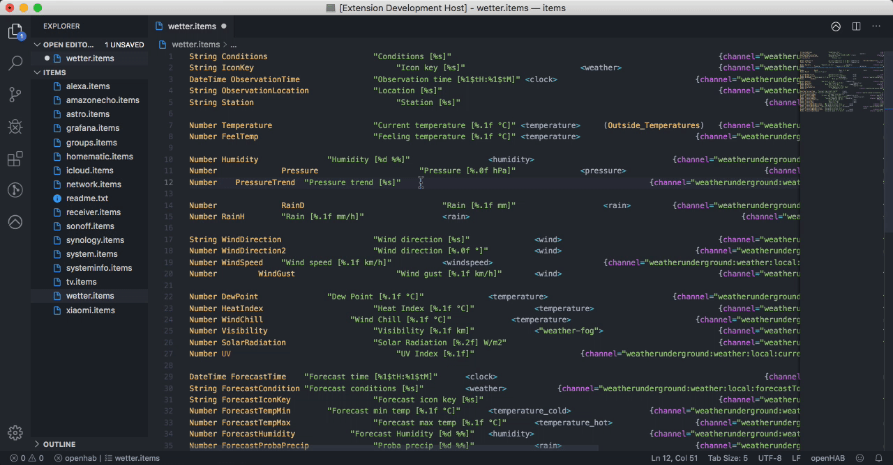

# openHAB Alignment Tool

This extension adds support for formatting and indenting [openHAB](http://www.openhab.org) files like `*.items`, `*.things`, etc. At the moment only the `*.item`-files are supported. They can be formatted in a column style. In the future the other file types and other format-types will be added. Feel free to enter feature-requests.

## Features

The tool is available via the Command-Palette. Just type `cmnd+shift+p` and enter `openHAB Alignment Tool`. Then you get the option to format the whole file.

## Limitations

-    Only `*.item`-files are supported. More file-types will follow in the future.
-    Only column-style formatting is supported. More styles will follow in the future.

## Extension Settings

Add extension settings here.

## Known Issues

See [Github Issues](https://github.com/MaxBec/openHAB-Alignment-Tool/issues) file for the details.

## Release Notes

See [CHANGELOG.md](https://github.com/MaxBec/openHAB-Alignment-Tool/blob/master/CHANGELOG.md) file for the details.

---

### For More Information

-    [openHAB Documentation](https://www.openhab.org/docs/)
-    [openHAB Community](https://community.openhab.org)

**Enjoy!**
